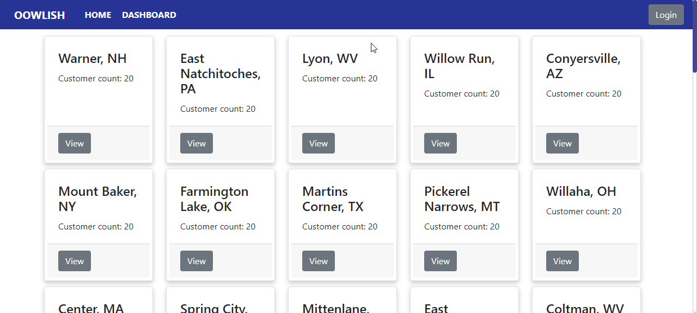

# REACT GRAPHQL APP

## Introduction
---
This app is combined in a monorepo, it has a Backend part which is an API done with Express and GraphQL, and the Frontend part which is the React App using Apollo Client.

## Características
---

| Attribute | Value |
| --- | --- |
| Type | Web Site |
| Backend | Node Express |
| Frontend | React |

## Libraries
---
### API Libraries
- "cors": "^2.8.5"
- "express": "^4.17.1"
- "express-graphql": "^0.12.0"
- "graphql": "^15.5.0"
### Client Libraries
- "@apollo/client": "^3.3.13"
- "@auth0/auth0-react": "^1.4.0"
- "bootstrap": "^4.5.3"
- "google-map-react": "^2.1.9"
- "graphql": "^15.5.0"
- "react": "^17.0.1"
- "react-dom": "^17.0.1"
- "react-router-dom": "^5.2.0"
- "react-scripts": "4.0.1"
- "reactstrap": "^8.8.1"
- "styled-components": "^5.2.3"

## API Endpoints
---
### **Total Customers by City**
Gives a list of cities and the total number of customers associated to them.

#### **Sample Request**
```hs
{
  getTotalCustomersByCity {
    city
    customers_total
  }
}
```
#### **Sample Response**
```hs
{
  "data": {
    "getTotalCustomersByCity": [
      {
        "city": "Warner, NH",
        "customers_total": 20
      },
      {
        "city": "East Natchitoches, PA",
        "customers_total": 20
      }, ...
```
### **Customers By City**
Gets the list of customers that are associated to a given city.
It receives 3 parameters
| Parameter | Type | Example | Description 
| --- | --- | --- | --- |
| **city** | String | "Warner, NH" | Name of the city to filter |
| **size** | Int | 5 | Set the number of rows retreived per page |
| **page** | Int | 2 | Set the current page | 

#### **Sample Request**
```hs
{
    getCustomersByCity(city: "Conyersville, AZ", size: 5, page: 1) {
        id
        first_name
        last_name
        email
        company
    }
}
```
#### **Sample Response**
```hs
{
  "data": {
    "getCustomersByCity": [
      {
        "id": 5,
        "first_name": "Benjamin",
        "last_name": "Cooper",
        "email": "bcooper4@biglobe.ne.jp",
        "company": "Youtags"
      }, ...
```
### **Customer by ID**
Get the data of the customer with a given ID
| Parameter | Type | Example | Description 
| --- | --- | --- | --- |
| **id** | Int | 3 | Customer ID |
#### **Sample Request**
```hs
{
  getCustomerByID(id: 3) {
    id
    first_name
    last_name
    email
    gender
    company
    city
    title
    lat
    long
  }
}
```
#### **Sample Response**
```hs
{
  "data": {
    "getCustomerByID": {
      "id": 3,
      "first_name": "Craig",
      "last_name": "Mccoy",
      "email": "cmccoy2@bluehost.com",
      "gender": "Male",
      "company": "Quatz",
      "city": "Lyon, WV",
      "title": "Senior Sales Associate",
      "lat": null,
      "long": null
    }
  }
}
```
## React Client
Its the web application that uses React and Apollo Client to show the Customer data to the end user.
### **Pages**
### **Home Page**
Conventional Home page using bootstrap

### **Dashboard Page**
Uses the first endpoint of the API to show cards for each city and their customer counter.

### **Customers by City**
When the button of a card is clicked it redirects to a page with the list of customers from that that city. It has pagination.

### **Customer Detail**
When a customer is clicked it redirects to a page with the customer data and a map that shows their location.

